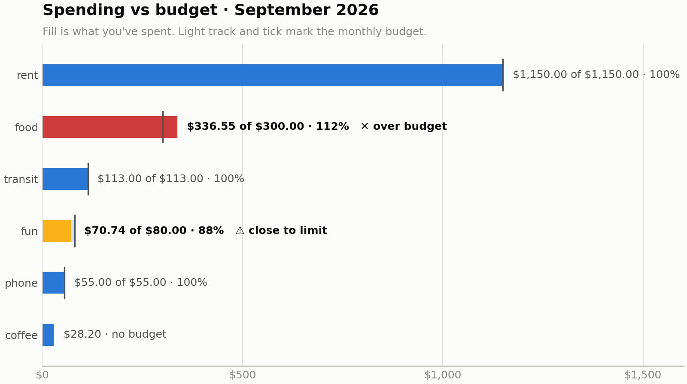
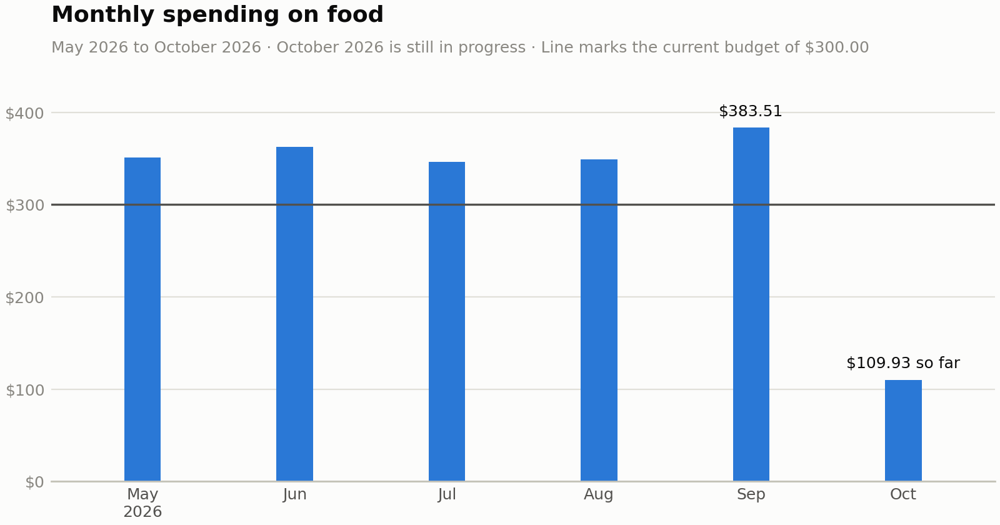
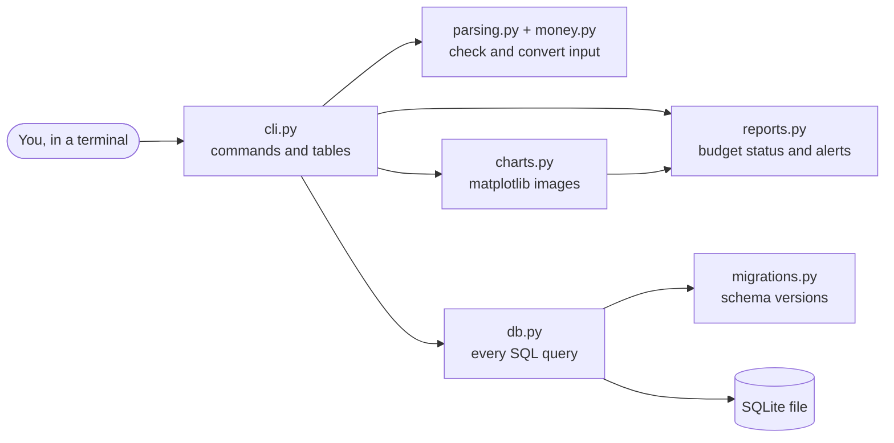
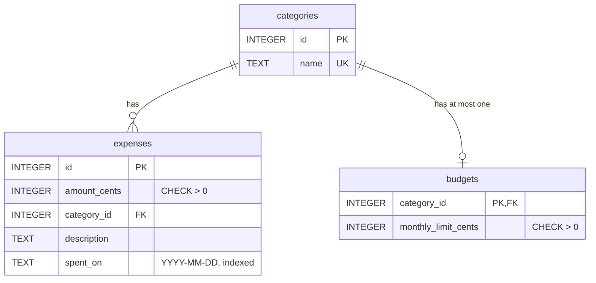

# Expense Tracker

[](https://github.com/omdkpatel810-ops/expense-tracker/actions/workflows/tests.yml)


[](LICENSE)

Track your spending from the command line, set monthly budgets, and get warned before you overspend. Expenses live in a local SQLite database, so your data stays on your machine.


**At a glance**

- 143 tests with 99.8% line coverage, run on every push on Python 3.10 and 3.13; CI fails below 95%
- The monthly report runs in **2.7 ms on 100,000 expenses**, after benchmarking found and fixed an index that made long date ranges slower (see [Performance](#performance))
- Versioned schema migrations: a database from the very first release opens in the current version with every expense kept

## Charts

```bash
expense chart budget --month 2026-09
```



```bash
expense chart trend --category food
```



## Features

- **Add expenses** with an amount, category, optional description and date (`today`, `yesterday` or `YYYY-MM-DD`)
- **List expenses** newest first, filtered by month and/or category, with a running total
- **Categories** are normalized, so `Food`, `food` and ` food ` are the same category
- **Monthly budgets** per category
- **Monthly reports** of spending against each budget: money left, percent used and status
- **Budget warnings** the moment an expense takes a category to 80% of its budget or over it
- **Charts** saved as PNG, SVG or PDF: spending against each budget for a month, and monthly totals over time
- **Automatic upgrades**: a database created by an older version is migrated on open, keeping every expense
- **Clear errors** for bad input, like `error: Amount can have at most 2 decimal places, like 12.99.`

## Quick start

Requires Python 3.10 or newer.

```bash
git clone https://github.com/omdkpatel810-ops/expense-tracker.git
cd expense-tracker
python3 -m venv .venv
source .venv/bin/activate        # Windows: .venv\Scripts\activate
pip install -e ".[dev]"

python scripts/demo.py           # optional: six months of sample data in demo.db
EXPENSE_DB=demo.db expense report --month 2026-09
```

## Usage

```bash
expense add 12.50 food "Lunch at Subway"              # dated today
expense add 4.25 coffee --date yesterday
expense add 64.37 groceries "Superstore" --date 2026-08-28

expense list                                         # latest 20
expense list --month 2026-09                         # all of September
expense list --month 2026-09 --category food --limit 50

expense budget set food 300                          # $300 a month for food
expense budget list
expense categories

expense report                                       # this month
expense report --month 2026-09

expense chart budget                                 # saves budget-2026-10.png
expense chart budget --month 2026-09 --output sept.pdf
expense chart trend                                  # last 6 months, all spending
expense chart trend --months 12 --category food      # with the food budget line
```

Data is stored in `~/.expense_tracker/expenses.db`. Set `EXPENSE_DB=/path/to/file.db` or pass `--db` to use a different file.

## How it works



Each module has one job, and only `db.py` talks to the database. `reports.py` holds the budget rules as pure functions, with no SQL and no printing, so they're tested directly.

**Money is stored as integer cents.** Floats can't represent most decimal amounts exactly (`0.1 + 0.2 == 0.30000000000000004`), so totals drift as you add up many prices. Whole numbers of cents never drift.

**The schema is normalized.** Each category name is stored once, and expenses and budgets point to it by id with a foreign key. Foreign keys are switched on for every connection (SQLite leaves them off by default), and `CHECK` constraints reject a zero amount, a zero budget or a badly formatted date even if a bug slips past the input checks.



**Schema changes are versioned migrations.** Each database file stores its schema version in SQLite's `PRAGMA user_version`. When the app opens a file, it runs every newer migration from [`migrations.py`](expense_tracker/migrations.py), each inside its own transaction, so an upgrade either applies completely or rolls back. A test builds a file in the first release's format and checks that every expense, id and date survives the upgrade.

| Version | Change |
|---|---|
| 1 | `expenses` table with the category name stored on each row |
| 2 | `categories` table; `expenses` rebuilt with a `category_id` foreign key |
| 3 | `budgets` table, one monthly limit per category |
| 4 | covering index for report and trend totals (see [Performance](#performance)) |

**Month filters use a half-open range.** `--month 2026-09` becomes `spent_on >= '2026-09-01' AND spent_on < '2026-10-01'`, which is correct for every month length and lets SQLite use an index.

**All queries use `?` parameters**, never string formatting, which prevents SQL injection.

**Budget alerts follow one table of rules.** Percentages use integer math (`spent * 100 >= limit * 80`), so there's no float rounding right at the 80% line.

| Used | Status | Alert? |
|---|---|---|
| under 80% | on track | no |
| 80% to 99% | close to limit | yes |
| exactly 100% | limit reached | no, because fixed bills like rent are budgeted at their exact amount |
| over 100% | over budget | yes |

**Charts follow a few fixed design rules.** One series color, with amber and red reserved for "close to limit" and "over budget" and always paired with a text label, so color is never the only signal. Thin bars, hairline gridlines, and labels only where they matter. End-of-bar labels are measured with matplotlib's renderer and the axis is widened until they fit, so nothing is cut off. Charts are drawn on `matplotlib.figure.Figure` directly instead of `pyplot`, so there's no global state or GUI backend, and matplotlib is imported only when a chart is drawn, so the other commands start in about 0.06 s.

## Performance

[`scripts/benchmark.py`](scripts/benchmark.py) builds a database of 100,000 expenses (three years, 12 categories) and times the app's real queries, median of 15 runs:

| Query | No date index | Date index only | Date + covering index | Speedup |
|---|---:|---:|---:|---:|
| Monthly report totals (one month) | 9.52 ms | 4.49 ms | **1.88 ms** | 5.1x |
| List one month, newest 20 | 8.92 ms | 0.07 ms | **0.13 ms** | 68.8x |
| 12-month trend totals | 30.59 ms | 63.01 ms | **14.39 ms** | 2.1x |
| `expense report` end to end | 12.85 ms | 7.36 ms | **2.70 ms** | 4.8x |

The first benchmark showed the date index making the 12-month trend **twice as slow** as no index at all. A year matches about a third of all rows, and with a plain index on `spent_on` every match is a separate lookup back into the table, which costs more than reading the whole table in order. Migration 4 adds a covering index on `(spent_on, category_id, amount_cents)`, which holds every column the totals need, so SQLite answers from the index alone. Tests check the query plans, so a later change can't silently undo it. Your numbers will vary by machine; run `python scripts/benchmark.py` to measure your own.

## Running the tests

```bash
python -m pytest --cov
```

143 tests, 99.8% line coverage. They also run on every push with GitHub Actions on Python 3.10 and 3.13, and CI fails if coverage drops below 95%.

## Roadmap

- [x] Add, list and categorize expenses from the command line
- [x] Normalized schema: categories table, budgets table, migrations
- [x] Monthly reports and budget alerts
- [x] Spending charts with matplotlib
- [x] Benchmarked and indexed for 100,000+ expenses
- [ ] Delete and edit expenses

## License

[MIT](LICENSE)
