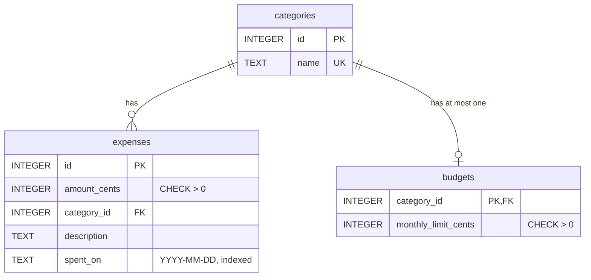

# Expense Tracker


Track your spending from the command line, set monthly budgets, and get warned before you overspend. Expenses are saved in a local SQLite database, so your data stays on your machine and survives restarts.

```text
$ expense add 48.75 food "Costco"
Added #8: $48.75 · food · 2026-10-04 · Costco
! food is at 84% of its $300.00 budget for October 2026, $47.25 left.

$ expense report
Spending report: October 2026

Category      Spent     Budget     Left  Used  Status
--------  ---------  ---------  -------  ----  --------------
rent      $1,150.00  $1,150.00    $0.00  100%  limit reached
food        $252.75    $300.00   $47.25   84%  close to limit
transit     $113.00    $113.00    $0.00  100%  limit reached
fun          $93.50     $80.00  -$13.50  116%  over budget
coffee        $4.25          -        -     -  no budget

Total spent: $1,613.50
Budgeted categories: $1,609.25 of $1,643.00 (97%)

Alerts
  ! food is at 84% of its $300.00 budget for October 2026, $47.25 left.
  ! fun is $13.50 over its $80.00 budget for October 2026 ($93.50 spent).
```

## Features

- **Add expenses** with an amount, category, optional description and date (`today`, `yesterday` or `YYYY-MM-DD`)
- **List expenses** newest first, filtered by month and/or category, with a running total
- **Categories** are normalized, so `Food`, `food` and ` food ` are the same category
- **Monthly budgets** per category, shown next to each category's expense count
- **Monthly reports** of spending against each budget: money left, percent used and status
- **Budget warnings** the moment an expense takes a category to 80% of its budget or over it
- **Automatic upgrades**: a database created by an older version is migrated on open, keeping every expense
- **Clear errors** for bad input, like `error: Amount can have at most 2 decimal places, like 12.99.`

## Quick start

Requires Python 3.10 or newer.

```bash
git clone https://github.com/omdkpatel810-ops/expense-tracker.git
cd expense-tracker
python3 -m venv .venv
source .venv/bin/activate        # Windows: .venv\Scripts\activate
pip install -e ".[dev]"
expense --help
```

## Usage

```bash
expense add 12.50 food "Lunch at Subway"              # dated today
expense add 4.25 coffee --date yesterday
expense add 64.37 groceries "Superstore" --date 2026-08-28

expense list                                         # latest 20
expense list --month 2026-09                         # all of September
expense list --month 2026-09 --category food --limit 50

expense budget set food 300                          # $300 a month for food
expense budget list
expense categories

expense report                                       # this month
expense report --month 2026-09
```

```text
$ expense list
ID  Date        Category      Amount  Description
--  ----------  ---------  ---------  ---------------
 1  2026-09-30  rent       $1,150.00  October rent
 4  2026-09-29  coffee         $4.25
 2  2026-09-29  food          $12.50  Lunch at Subway
 3  2026-09-15  transit      $113.00  U-Pass top-up
 5  2026-08-28  groceries     $64.37  Superstore run

Total for 5 expenses: $1,344.12

$ expense categories
Category   Expenses  Monthly budget
---------  --------  --------------
coffee            1               -
food              2         $300.00
groceries         1               -
rent              1       $1,150.00
transit           1         $113.00
```

Data is stored in `~/.expense_tracker/expenses.db`. Set `EXPENSE_DB=/path/to/file.db` or pass `--db` to use a different file.

## How it works

```text
expense_tracker/
  cli.py         reads command-line arguments, prints tables
  parsing.py     checks categories, dates and months typed by the user
  money.py       converts "12.50" to 1250 cents and back
  db.py          the only module that runs SQL queries
  migrations.py  every version of the database schema, in order
  reports.py     budget status and alert rules (no SQL, no printing)
tests/           one test file per module (112 tests)
```

**Money is stored as integer cents.** Floats can't represent most decimal amounts exactly (`0.1 + 0.2 == 0.30000000000000004`), so totals drift as you add up many prices. Whole numbers of cents never drift.

**The schema is normalized.** Each category name is stored once, and expenses and budgets point to it by id with a foreign key. Foreign keys are switched on for every connection (SQLite leaves them off by default), and `CHECK` constraints reject a zero amount, a zero budget or a badly formatted date even if a bug slips past the input checks.



**Schema changes are versioned migrations.** Each database file stores its schema version in SQLite's `PRAGMA user_version`. When the app opens a file, it runs every newer migration from [`migrations.py`](expense_tracker/migrations.py), each inside its own transaction, so an upgrade either applies completely or rolls back. A database from the first release (version 0, one `expenses` table with the category name on each row) is upgraded to version 3 with every expense, id and date kept. That upgrade is covered by a test that builds an old-format file and opens it.

| Version | Change |
|---|---|
| 1 | `expenses` table with the category name stored on each row |
| 2 | `categories` table; `expenses` rebuilt with a `category_id` foreign key |
| 3 | `budgets` table, one monthly limit per category |

**Month filters use a half-open range.** `--month 2026-09` becomes `spent_on >= '2026-09-01' AND spent_on < '2026-10-01'`, which is correct for every month length and lets SQLite use the date index.

**All queries use `?` parameters**, never string formatting, which prevents SQL injection.

**Budget rules live in one pure module.** [`reports.py`](expense_tracker/reports.py) takes totals in cents and returns each category's status, with no database or printing code, so every boundary is tested directly. Percentages use integer math (`spent * 100 >= limit * 80`), so there's no float rounding right at the 80% line.

| Used | Status | Alert? |
|---|---|---|
| under 80% | on track | no |
| 80% to 99% | close to limit | yes |
| exactly 100% | limit reached | no, because fixed bills like rent are budgeted at their exact amount |
| over 100% | over budget | yes |

## Running the tests

```bash
python -m pytest -v
```

Tests also run automatically on every push with GitHub Actions, on Python 3.10 and 3.13.

## Roadmap

- [x] Add, list and categorize expenses from the command line
- [x] Normalized schema: categories table, budgets table, migrations
- [x] Monthly reports and budget alerts
- [ ] Delete and edit expenses
- [ ] Spending charts with matplotlib
